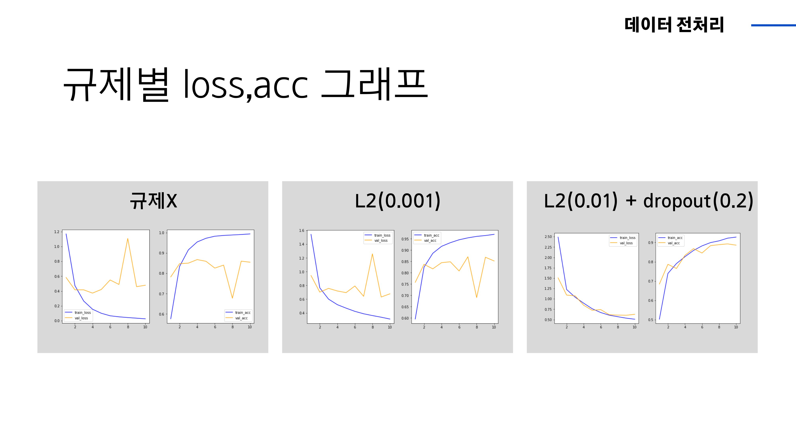

# 얼굴 인식을 활용한 출석 체크
## 프로젝트 소개
현재 교육 받는 강의장은 아침, 점심에 매번 출석명부에 서명하여 출석 확인하는 시스템으로 운영되고 있습니다. 하지만 깜박하기도 하고 다른 사람이 적어 줄 수도 있는 등 불편하고 허술한 점이 있습니다. 이를 해결해 보고자 사전에 AI hub 기관에 의뢰한 한국인 안면 이미지 데이터 800만장으로 모델 학습, 얼굴 인식으로 출석체크 시스템을 구축했습니다.

### 프로젝트 기간
2022.12.21 ~ 2022.12.27

### 참여 인원
* [@심현우](https://github.com/hwbest403): openCV
* [@고준호](): ppt, 발표
* [@곽지섭](https://github.com/RynuRen): 데이터 전처리, yolo
* [@윤율](): 프로젝트 메니저
* [@임정민](https://github.com/min731): 데이터 전처리, CNN
* [@장동근](): 프론트엔드

### 사용 기술

    
    
    
    
    
    
    

### 개발 환경 및 라이브러리
Windows10 , python3.10, jupyter notebook, Google colab, sklearn, tensorflow, yolov5, openCV

## 구상

# 구현
## 데이터 전처리

한국과학기술연구원 인공지능 연구단에 한국인 안면 이미지를 신청하여 제공 받았습니다. 일반인을 모집해 수집된 데이터이므로 저희 프로젝트에서 사용한 데이터는 유포 금지에 대한 서약에 의해 공개 할 수 없습니다.

한국인 안면 데이터셋은 해상도, 인물별ID, 악세서리, 명도, 표정, 카메라 각도 등 총 840만장의 이미지 파일로 되어 있었습니다. 이 중에 고화질의 가장 밝은 명도의 이미지만 사용하여 총 93,600장의 이미지 파일로 프로젝트를 진행했습니다.

6가지의 악세서리와 3가지 표정을 합쳐 총 18개의 클래스를 만들었습니다. 핸드폰의 잠금 해제를 할 때도 악세서리들이 있으면 방해가 되듯 출석체크를 위한 안면 인식에 있어서도 악세서리들이 방해가 될 것이라 판단하여 6가지 악세서리 착용여부를 분류할 수 있는 모델을 만들기 위해 레이블을 분류했습니다.

우선 전처리한 데이터를 yolo 모델에 학습 시켰습니다. 저희가 받은 데이터에 사진마다 사람 얼굴의 좌표값과 악세서리와 표정을 합친 레이블을 함께 학습시켜서 결과적으로 영상이나 이미지에서 사람 얼굴에 네모 박스를 치고 18개에 대한 레이블 값을 결과로 낼 수 있었습니다. 기존에 있던 yolo 모델이 아닌 저희가 93,600장을 새롭게 학습시킨 모델이라고 보시면 될 것 같습니다.

<table>
    <tr>
        <td>
            
        </td>
        <td>
            
        </td>
        <td>
            
        </td>
    <tr>
</table>

yolo 모델에 대한 검증입니다. Epoch가 늘어나면서 mAP가 1에 가까이 가는 것을 보면 결과적으로 사람의 얼굴에 찾는데에 있어서 정확도가 높다는 것을 알 수 있습니다.

Loss가 계속 감소하는걸로 보아 학습이 잘 진행되는 것을 알 수 있었습니다.

테스트로 넣은 아이유 사진에도 선글라스 착용, 모자 등 잘 분류하는 것을 확인했습니다.

<table>
    <tr>
        <td>
            
        </td>
        <td>
            
        </td>
        <td>
            
        </td>
    <tr>
</table>

yolo 이외에 분류 모델도 만들어보았습니다. 우선 이미지 제너레이터 과정을 거쳤습니다 해상도가 높아서 학습에 있어 매우 오랜 시간이 걸려, 이를 방지하기 위해 해상도를 낮췄습니다.여러가지 해상도를 해 보았을 때 200x300이 가장 적합했습니다.

그 다음 CNN , DNN을 활용 하여 이미지를 분류했습니다. 아이유의 사진으로 레이어들을 통과하는 모습을 보실 수 있습니다.

초기 학습 모델의 test 정확도가 낮아 규제를 조금씩 적용하면서 Train 데이터의 acc곡선과 loss곡선이 비슷한 경향을 띄게 했습니다.이로써 실제 검증 시에 모델의 성능을 더욱 높일 수 있었습니다.여기까지 액세서리를 분류하는 모델입니다.

<table>
    <tr>
        <td>
            
        </td>
        <td>
            
        </td>
        <td>
            
        </td>
    <tr>
</table>

다음으로 특정 인물임을 인식할 수 있게 해주는 Face-Recognition입니다. OpenCV 라이브러리를 사용해서 출석체크 시스템에 중요하게 사용되는 얼굴의 특징을 인식했습니다.

# 한계점 및 과제

이번 프로젝트에서 한계점은 모델의 성능입니다. 모델 정확도를 가장 떨어뜨렸던 케이스 중 하나가 머리를 모자로 인식한 경우였습니다. 해당 부분은 학습데이터들 중 어두운 조명에서의 모자를 쓰고 있는 데이터들이 상당수 포함되어 있어 발생한 문제로 예측되어 더욱 섬세한 데이터 수집과 정제 과정이 필요하다는 것을 느꼈습니다.

# Reference
* [파이썬 얼굴 인식](https://ukayzm.github.io/python-face-recognition/)
* [파이썬 음성 합성](https://wikidocs.net/15213)
* [Face_recognition 패키지](https://github.com/ageitgey/face_recognition)